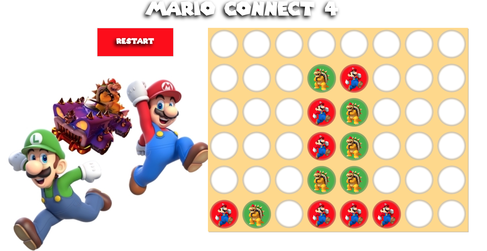

#Mario Connect 4

##Description

Join in the epic battle in the most iconic video game showdown. Play with a friend as one player will side with Mario while the other sides with Bowser in this ultimate duel. Whichever player succeeds to connect four of their tokens will be the victor!

##Screenshot

##Concept
Connect 4 is a pretty universal game, so no initial wireframes were created. During my brainstorm, I envisioned two buttons for start and restart, accompanied by a 6x8 grid for the game itself. I al
##Technologies Used
* HTML
* CSS
* jQuery
* Javascript

##Getting Started
<https://wasuen.github.io/Game-Project-1/>

##Next Steps
####Future plans include:
* Adding a story page before leading to game start.
* Adding sound affects to when token is dropped.
* Adding score board for rounds won.

####Unresolved issues
* Upon restart the winner of the last round begins the new round. Future feature should allow the loser to start.